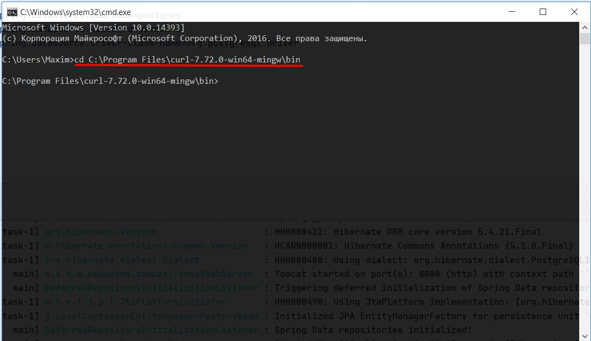
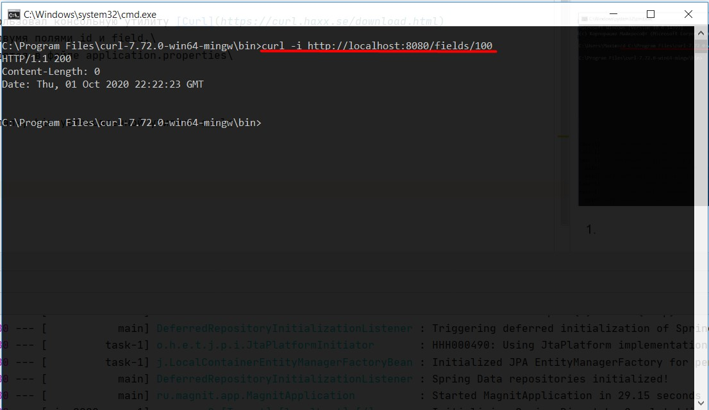
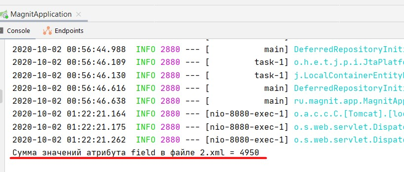

## Тестовое задание
**Использовал SpringBoot, PostgreSQL.**

*При запуске приложение удаляет все записи в б.д. После происходит вставка новых записей в базу и создаётся файл 1.xml.\
В корне проекта создал файл template.xsl, в котором средствами Xpath идёт преобразование в цикле for-each файла 1.xml.\
В методе transfromXmlFile() идёт создание нового фалйа 2.xml*

Создана таблица Test с двумя полями id и field.\
В качестве запросов к серверу использовал консольную утилиту [Curl](https://curl.haxx.se/download.html)\
Настройки подключения к базе находятся в файле application.properties.\
После запуска проекта необходимо:

* **В коммандной строке перейти в папку bin установленной утилиты curl.**

#
* **Выполнить запрос к серверу набрав команду curl -i http://localhost:8080/fields/100, где 100 - число созданных записей в б.д..**

#

* **После успешного выполнения сумма значений появится в окне консоли.**

